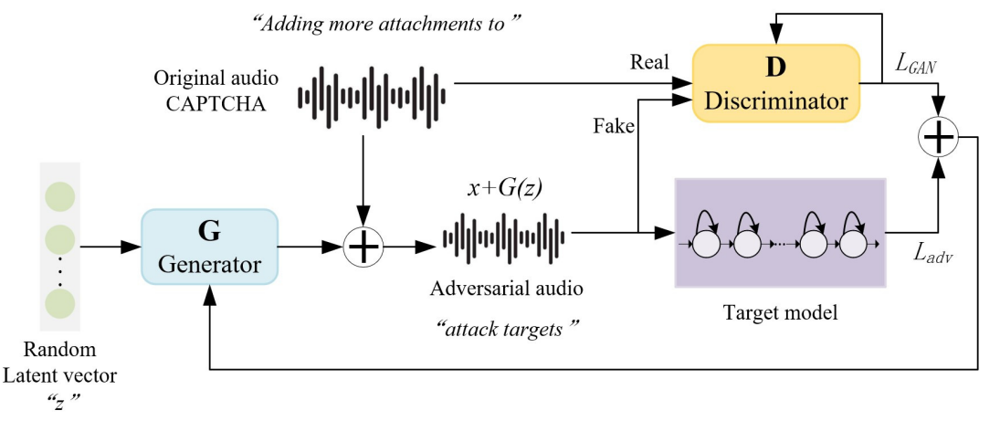

# AdvAudioCaptcha（Improving the Security of Audio CAPTCHAs with Adversarial Examples）
This is the official code for the paper "Improving the Security of Audio CAPTCHAs with Adversarial Examples" by Ping Wang, Haichang Gao,  Xiaoyan Guo, Zhongni Yuan and Jiawei Nian.
## Prerequisites
 - Python(3.5)
 - Tensorflow(1.13.1)
 - CUDA
 - numpy
 
 More details are in requirements.
 
 ## Install
We suggest to install the dependencies using Anaconda or Miniconda. And then install prerequisites:

    $ pip install -r requirements.txt

## How to generate adversarial audio CAPTCHAs?

**Preprocess**

All the dataset should be:  single channel, int16, 16000Hz, wav format.

    $ python ./data/data_process_code/audio_format.py
  For reCAPTCHA v2, you need to cut out noise on both sides and pad.

    $ python ./data/data_process_code/cut_noise.py
    $ python ./data/data_process_code/padding.py
 Then, divide the dataset according to a certain proportion into train set, validation set and test set and gain the original transcription.

    $ python ./data/data_process_code/audio_getTran.py
    $ python deepSpeech_call.py
    $ python lingvo_call.py
    $ python jasper_call_new.py
    $ python w2l_call_new.py

And the length of transcriptions needs to be uniform,

    $ python ./data/data_process_code/unify_audio_tran.py

**Train**

For main experiments and ensemble training:

     $ python main_1asr.py # train only with DeepSpeech.
     $ python main_1lingvo.py # train only with Lingvo.
     $ python main_2.py # ensemble train for K=2.
     $ python main_3.py # ensemble train for K=3.
     $ python main_4.py # ensemble train for K=4.

Universal GAN:

     $ python main_deepspeech.py: train only with DeepSpeech.

**Note*:*
When integrating different ASRs to generate adversarial audio CAPTCHAs, you need first deploy the running environment of the ASRs.
In our project, we integrate [DeepSpeech 0.4.1](https://github.com/mozilla/DeepSpeech), [Lingvo](https://github.com/tensorflow/lingvo), [Wave2Letter+ and Jasper](https://github.com/NVIDIA/OpenSeq2Seq). All the pre-trained models of these ASRs can be download officially. And to integrate Wave2Letter+ and Jasper, we modified the code of OpenSeq2Seq to gain the logits.

**Test**

For main experiments and ensemble training:

    $ python advGenerate2.py # test for K=2.
    $ python advGenerate3.py # test for K=3.
    $ python advGenerate4.py # test for K=4.

Universal GAN:

    $ python main_deepspeech_test.py
